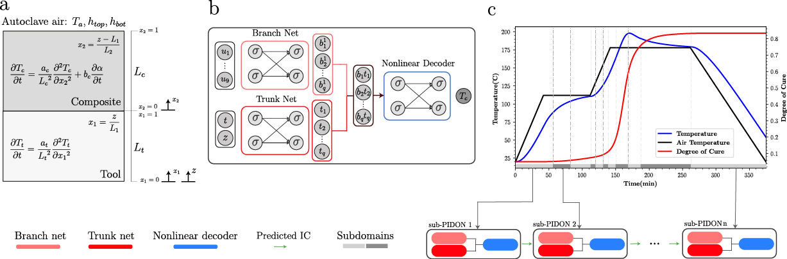

# Extended Physics-Informed DeepONet (XPIDON) for Autoclave Composite Curing

Code for **Extended Physics-Informed DeepONet (XPIDON)** — accepted at the [ICLR 2025 AI4Mat Workshop](https://sites.google.com/view/ai4mat/ai4mat-iclr-2025/accepted-work-ai4mat-iclr-2025).  

**This work has been developed by Quantiphi’s PhiLabs.**

This repository implements an **Extended Physics-Informed DeepONet (XPIDON)** model for simulating autoclave composite curing processes. It features a **nonlinear decoder**, **subdomain-specific input normalization**, and an **adaptive and automated domain decomposition strategy**.

## Overview

The project addresses the challenge of long-duration transient simulations by decomposing the time domain into smaller subdomains. The XPIDON model is trained sequentially on these subdomains. An adaptive splitting mechanism refines subdomains if training losses exceed a tolerance, enabling automated refinement where the model struggles most.

### Model Architecture

The XPIDON model is based on the DeepONet architecture, which learns operators mapping input functions to output functions. It comprises a Branch Network (for input functions), a Trunk Network (for spatio-temporal coordinates), and a Nonlinear Decoder. The use of a nonlinear decoder enhances the model's ability to capture complex relationships, while separate input normalization handle spectral bais.


*a) Schematic representation of the composite-tool system inside an autoclave, including local coordinates `x₁` and `x₂`. b) Architecture of the proposed sub-XPIDON model for predicting part temperature G^(T_c). The same architecture is utilized for other output variables, including degree of cure G^(α) and tool temperature G^(T_t). c) Illustration of the proposed XPIDON framework with a nonlinear decoder and domain decomposition, designed for thermochemical analysis during the composite curing process.*


## Getting Started

1.  **Clone the repository:**
    ```bash
    git clone https://github.com/Quantiphi-INC/XPIDON-Composites.git
    cd XPIDON-Composites
    ```
2.  **Install dependencies:**
    ```bash
    pip install -r requirements.txt
    ```
    (Ensure JAX is installed correctly for your CPU/GPU setup as per JAX documentation.)
3.  **Prepare `exp_params.json`, `phy_params.json` and `train_params.json` ** in the root directory.
    *   **`phy_params.json`**: Modify physical material properties (e.g., thermal conductivities, cure kinetics constants) here.
    *   **`exp_params.json`**: Adjust experimental parameters such as the range of input functions (ramp rates, hold temperatures, durations, heat transfer coefficients, tool thickness), total process time, and initial conditions.
    *   **`train_params.json`**: Configure training parameters, such as the number of collocation points, batch sizes, and weights assigned to each loss component.
4.  **Run the training:**
    ```bash
    python main_run.py
    ```
    The `main_run.py` file orchestrates the training process. You can modify hyperparameters like network layer sizes (`branch_layers`, `trunk_layers`, `nomad_layers_T`), initial number of subdomains (`init_sub_domain`), and loss tolerance (`Tolerance_level`) directly within this file before running.

## Notes
This codebase can also be adapted for our paper:  
[**An advanced physics-informed neural operator for comprehensive design optimization of highly-nonlinear systems: An aerospace composites processing case study**](https://www.sciencedirect.com/science/article/pii/S0952197624020451)  
(Requires removing the domain decomposition module and making a few modifications.)


## Citation  

If you find this work useful, please cite our paper:  

```bibtex
@article{@article{PATEL2025112935,
title = {An extended physics-informed neural operator for accelerated design optimization in composites autoclave processing},
journal = {Composites Part B: Engineering},
pages = {112935},
year = {2025},
issn = {1359-8368},
doi = {https://doi.org/10.1016/j.compositesb.2025.112935},
url = {https://www.sciencedirect.com/science/article/pii/S1359836825008418},
author = {Janak M. Patel and Milad Ramezankhani and Anirudh Deodhar and Dagnachew Birru}}
}
